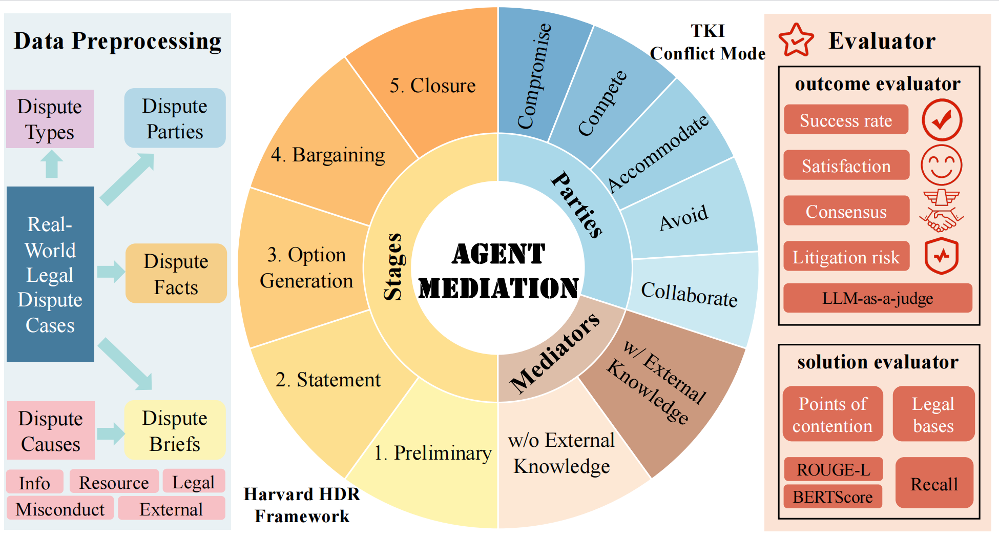

# AgentMediation



Legal mediation plays a crucial role in resolving civil disputes, yet its empirical study is limited by  **privacy constraints** and **multivariate interactions**. We present *AgentMediation*, the first LLM-based framework for simulating legal mediation. It generates realistic mediation processes grounded in real-world cases while enabling controllable experimentation on key variables such as disputant strategies, dispute causes, and mediator expertise. Our empirical analysis reveals patterns aligned with sociological theories, including **Group Polarization** and **Surface-Compliance**. As a comprehensive and extensible platform, *AgentMediation* paves the way for deeper integration of social science and AI in legal research.

---

## 📁 Project Structure

```
AGENTMEDIATION/
├── data/
│   ├── case_back.json
│   ├── data_resource.json
│   └── output_2025       # show a specific expample
├── src/
│   ├── agent.py
│   ├── arena.py
│   ├── chat-no-key.py
│   ├── env.py
│   ├── eval.py
│   ├── globals.py
│   ├── judge.py
│   ├── judge_mediator.py
│   ├── kafang_test.py
│   ├── mediator.py
│   ├── preliminary.py
│   ├── preprocess.py
│   └── statements.py
├── run.py                # Main entry point
├── run_exp1.sh           # Experiment 1 script
├── run_exp2.sh           # Experiment 2 script
├── run_exp3.sh           # Experiment 3 script
├── requirements.txt      # Python dependencies
└── README.md             # Project description
```

---

## 🚀 Quick Start

1. **Install dependencies**:
   ```bash
   pip install -r requirements.txt
   ```

2. **Run an experiment**:
   ```bash
   ./run_exp1.sh
   ```

3. **Or execute manually**:
   ```bash
   python run.py --model_name deepseek-v3-0324 --baseline --multi --date 2025
   ```

---
