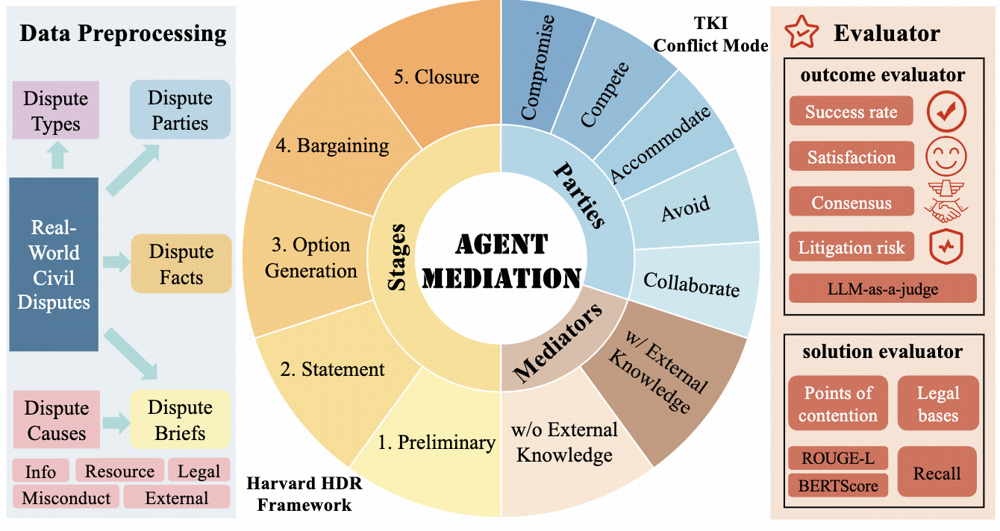

# Simulating Dispute Mediation with LLM-Based Agents for Legal Research

The official repo for our AAAI'26 Full paper: Simulating Dispute Mediation with LLM-Based Agents for Legal Research.



Legal dispute mediation plays a crucial role in resolving civil disputes, yet its empirical study is limited by privacy constraints and complex multivariate interactions. To address this limitation, we present AgentMediation, the first LLM-based agent framework for simulating dispute mediation. It simulates realistic mediation processes grounded in real-world disputes and enables controlled experimentation on key variables such as disputant strategies, dispute causes, and mediator expertise.
Our empirical analysis reveals patterns consistent with sociological theories, including Group Polarization and Surface Compliance. As a comprehensive and extensible platform, AgentMediation paves the way for deeper integration of social science and AI in legal research. [paper link](https://arxiv.org/pdf/2509.06586)

---

## 📁 Project Structure

```
AGENTMEDIATION/
├── data/
│   ├── case_back.json
│   ├── data_resource.json
│   └── output_2025       # show a specific expample
├── src/
│   ├── agent.py
│   ├── arena.py
│   ├── chat-no-key.py
│   ├── env.py
│   ├── eval.py
│   ├── globals.py
│   ├── judge.py
│   ├── judge_mediator.py
│   ├── kafang_test.py
│   ├── mediator.py
│   ├── preliminary.py
│   ├── preprocess.py
│   └── statements.py
├── run.py                # Main entry point
├── run_exp1.sh           # Experiment 1 script
├── run_exp2.sh           # Experiment 2 script
├── run_exp3.sh           # Experiment 3 script
├── requirements.txt      # Python dependencies
└── README.md             # Project description
```

---

## 🚀 Quick Start

1. **Install dependencies**:
   ```bash
   pip install -r requirements.txt
   ```

2. **Run an experiment**:
   ```bash
   ./run_exp1.sh
   ```

3. **Or execute manually**:
   ```bash
   python run.py --model_name deepseek-v3-0324 --baseline --multi --date 2025
   ```

---

## 🌟 Citations
If you find our work useful, please do not save your star and cite our work:

```
@article{chen2025simulating,
  title={Simulating Dispute Mediation with LLM-Based Agents for Legal Research},
  author={Chen, Junjie and Li, Haitao and Qin, Minghao and Zhou, Yujia and Ren, Yanxue and Wang, Wuyue and Liu, Yiqun and Wu, Yueyue and Ai, Qingyao},
  journal={arXiv preprint arXiv:2509.06586},
  year={2025}
}
```